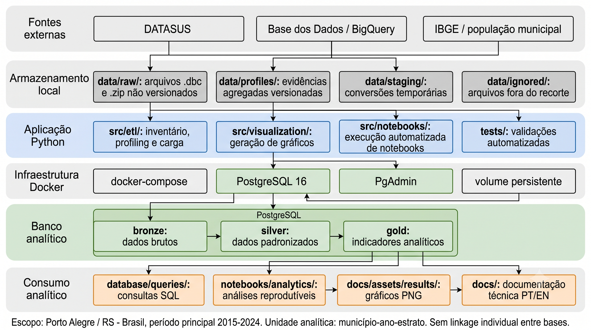
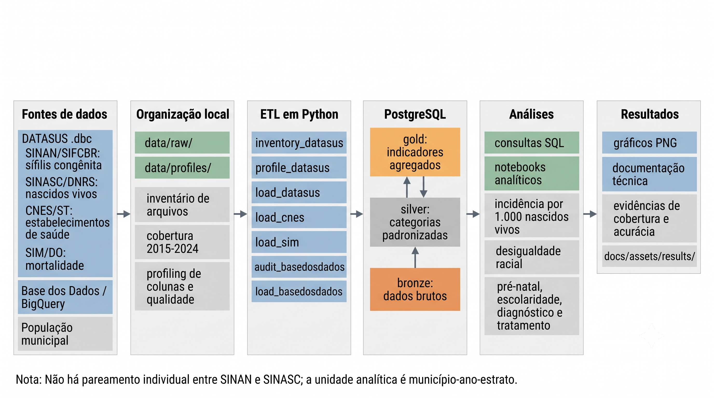

# Congenital Syphilis Analytics - Porto Alegre, RS, Brazil

Data project for analyzing congenital syphilis in Porto Alegre, Rio Grande do Sul, Brazil. The repository combines public DATASUS microdata, Python ETL, PostgreSQL, SQL indicators, notebooks, and documented visual results focused on racial inequality, prenatal care, maternal education, and recorded maternal care.

Full documentation:

- [Português](docs/README.pt-BR.md)
- [English](docs/README.en.md)

## Project Diagrams





## Quick Start

```bash
docker compose up -d
python -m pip install -r requirements.txt
python -m src.etl.load_datasus --strict
```
