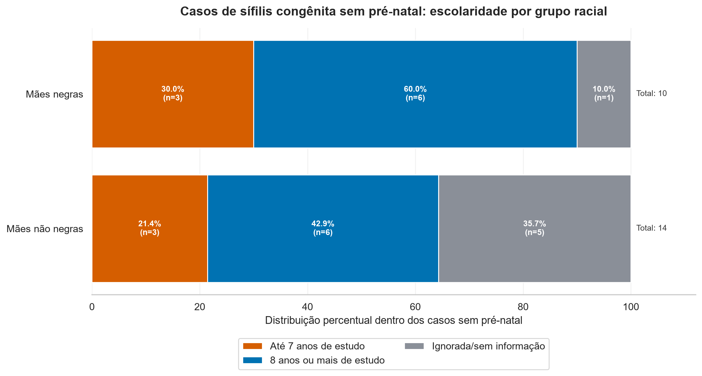

# Relatório

## Identificação

- **Nome**: <mark>Antonio de Pádua Santos Júnior</mark>
- **Cartão UFRGS:** <mark>00318785</mark>

## Dados utilizados

1. **Dataset 1**: <mark>`https://datasus.saude.gov.br/transferencia-de-arquivos/#`</mark>
    * **Descrição curta**: <mark>`SINAN/SIFCBR 2024 - Sífilis congênita: microdados de notificações de sífilis congênita em 2024, com informações sobre município de residência, raça/cor materna, realização de pré-natal, escolaridade materna e outros dados clínicos/epidemiológicos.`</mark>
2. **Dataset 2**: <mark>`https://datasus.saude.gov.br/transferencia-de-arquivos/#`</mark>
    * **Descrição curta**: <mark>`SINASC 2024 - Nascidos vivos: microdados de nascidos vivos no Rio Grande do Sul em 2024, usados como base complementar para o contexto do estudo, contendo informações sobre município de residência, raça/cor da mãe, escolaridade e consultas de pré-natal.`</mark>

## Código-fonte da visualização

- **Arquivo principal**: `notebooks/visualizacao_sifilis_congenita_poars.ipynb`
- **Arquivos complementares (se houver)**: `data/raw/SIFCBR24.dbc`; `data/raw/sinasc/DNRS2024.dbc`

## Imagem da visualização gerada

## Descrição da visualização

### Legenda (*caption*)

<mark>
A visualização compara a escolaridade materna nos casos de sífilis congênita sem pré-natal em Porto Alegre, separando mães negras e mães não negras. Cada barra horizontal representa um grupo racial e está dividida por cores: laranja indica até 7 anos de estudo, azul indica 8 anos ou mais de estudo e cinza indica escolaridade ignorada ou sem informação. O eixo horizontal mostra a distribuição percentual dentro de cada grupo, enquanto os rótulos indicam o percentual e o número absoluto de casos.
</mark>

### Conclusão demonstrada pela visualização

<mark>
Entre os casos sem pré-natal, mães negras apresentam maior proporção de baixa escolaridade: 30,0% têm até 7 anos de estudo, contra 21,4% entre mães não negras. Porém, há muitos registros com escolaridade ignorada entre mães não negras, o que limita a comparação. Assim, a visualização sugere uma possível desigualdade entre raça/cor, acesso ao pré-natal e escolaridade, mas os resultados devem ser interpretados com cautela pelo baixo número de casos analisados.
</mark>
